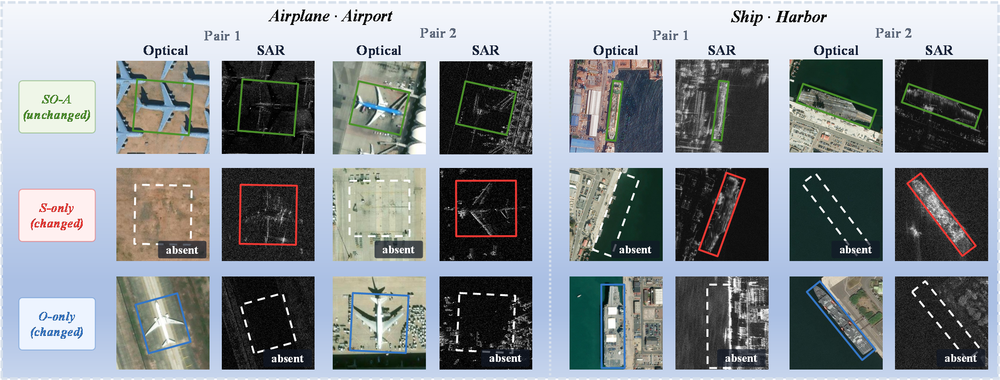
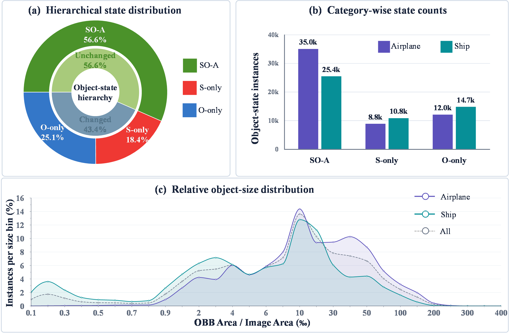
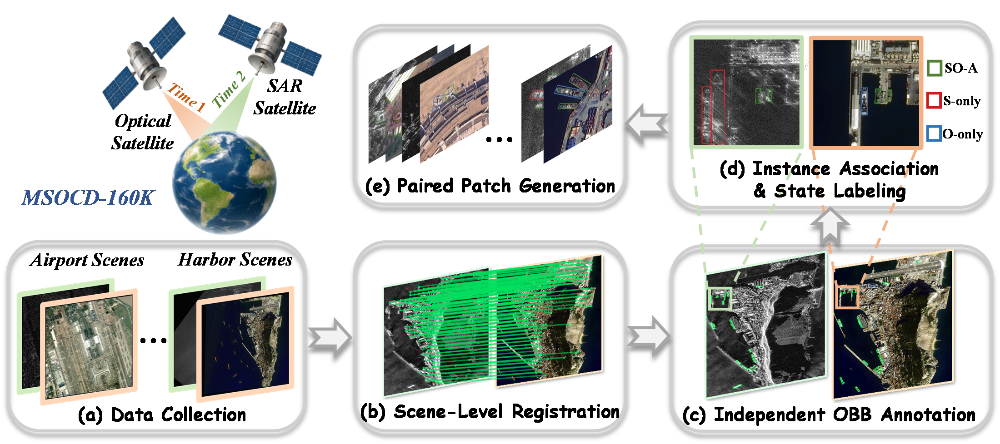
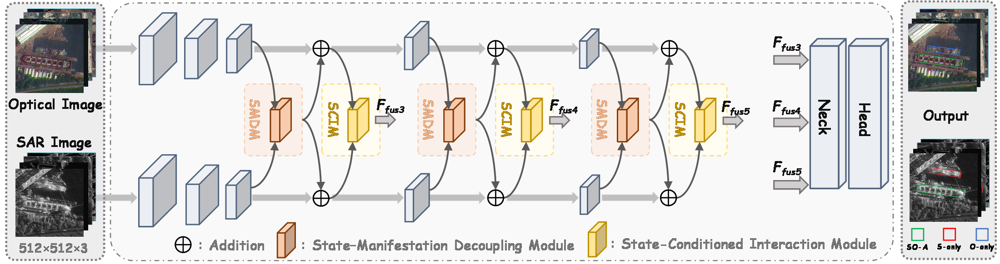

# MSOCD-160K & DASO-Det

**Multi-Source SAR–Optical Object-Level Change Detection Dataset**

Code and dataset information for **Toward Multi-Source SAR–Optical Object-Level Change Detection: A Benchmark Dataset and Unified Framework**.

Fanlong Meng, Fengli Xue, Kaiwei Li, and Xiangyang Qi.

MSOCD-160K supports joint oriented object localization and cross-observation state recognition from asynchronous SAR–optical image pairs. Unlike shared-label multimodal detection, it explicitly distinguishes associated objects from objects observed in only one modality.

## Dataset

The benchmark covers airports and harbors, with two object categories (airplane and ship) and three cross-observation states:

| State | Meaning |
| --- | --- |
| **SO-A** | SAR–Optical Associated: associated instances in both observations |
| **S-only** | An unmatched instance observed only in SAR |
| **O-only** | An unmatched instance observed only in optical imagery |

SO-A corresponds to the unchanged group; S-only and O-only form the changed group. The detector uses six category–state labels: two object categories × three states.



*Representative SO-A, S-only, and O-only samples from the manuscript.*

### Scale and split

MSOCD-160K contains 143 scene pairs and 21,481 paired 512 × 512 tiles. The optical sources include GF-2, GF-7, Jilin-1, and Google Earth; the SAR sources include GF-3, Umbra, ICEYE, and Capella. The manuscript reports image resolutions of 0.2–1 m.

| Split | Scene pairs | Paired tiles | Object–state instances |
| --- | ---: | ---: | ---: |
| Train | 100 | 15,008 | 73,875 |
| Test | 43 | 6,473 | 32,854 |
| Total | 143 | 21,481 | 106,729 |

The split is defined at the **scene-pair level**, so patches from the same source scene do not cross the train/test boundary. In the supplied training configuration, `val` and `test` both refer to the test subset; there is no separate validation subset.

**Counting convention.** An associated SO-A pair counts as one object–state instance but contributes an OBB annotation in each modality. The current local annotation files contain **167,125 modality-specific OBBs** (87,147 optical and 79,978 SAR), hence the “160K” dataset name. These box counts and the 106,729 object–state instances use different counting units. Run the dataset checker below to audit an available dataset version.



*State distribution, category-wise state counts, and relative object-size distribution from the manuscript.*

<details>
<summary>Dataset construction pipeline</summary>



Collection → scene registration → independent OBB annotation → cross-modal association and state labeling → paired patch generation.

</details>

### Availability

**The full dataset will be made public after the paper is accepted.** This repository currently provides the model implementation, main-component configurations, dataset format, and run instructions; it does not contain the raw imagery or trained checkpoints. Dataset and checkpoint download links will be added here when released.

### Directory layout and labels

```text
MSOCD-160K/
├── images/                 # Optical images
│   ├── train/
│   └── test/
├── imagesSAR/              # Paired SAR images; identical relative filenames
│   ├── train/
│   └── test/
├── labels/                 # Joint six-class, object-state OBB labels for training
│   ├── train/
│   └── test/
├── labelsOpt/              # Per-modality OBB annotations, if supplied
├── labelsSAR/              # Per-modality OBB annotations, if supplied
└── manifests/              # Dataset construction/split metadata, if supplied
```

For example, `images/train/example.png` must pair with `imagesSAR/train/example.png` and `labels/train/example.txt`. Each joint label line uses the YOLO-OBB format:

```text
class_id x1 y1 x2 y2 x3 y3 x4 y4
```

The four ordered polygon corners are normalized to [0, 1]. Class IDs are fixed:

| ID | Label | ID | Label |
| ---: | --- | ---: | --- |
| 0 | `plane_SO-A` | 3 | `ship_SO-A` |
| 1 | `plane_S-only` | 4 | `ship_S-only` |
| 2 | `plane_O-only` | 5 | `ship_O-only` |

The network input contains six channels in **[Optical RGB, SAR RGB]** order. A grayscale SAR image is read as three channels. Input pairs must have matching dimensions; do not replace missing SAR images with optical images.

## DASO-Det



DASO-Det combines a dual-branch YOLO11-OBB backbone with:

- **SMDM** — frequency-domain state/manifestation diagnostics and gated residual calibration.
- **SCIM** — shared ordered interaction, common–directional decomposition, and state-conditioned routing.

The supplied lightweight implementation uses `SMDMLiteV2` and full-width `SCIMV2` at **C3, C4, and C5**. SMDM uses mixed dense/depthwise spatial blocks; its residual generator predicts separate SAR and optical corrections from modality features and manifestation diagnostics. State diagnostics control the update through CRCM. SCIM uses a state width equal to the feature width (`state_ratio=1.0`).

Four main-component configurations are provided: `baseline` (additive fusion), `smdm` (SMDM only), `scim` (SCIM only), and `daso-det` (both modules).

All four configurations use the `n` scale, six classes, and paired 512 × 512 inputs. SMDM defaults to **β = 0.25** and **α = 0.10**.

## Setup

Python 3.8+ is supported; a dedicated environment is recommended. Install a compatible PyTorch/torchvision pair for your CUDA environment first, then install this repository:

```bash
git clone https://github.com/meng0505/MSOCD-160K.git
cd MSOCD-160K
python -m venv .venv
# Linux/macOS: source .venv/bin/activate
# Windows PowerShell: .venv\Scripts\Activate.ps1
python -m pip install --upgrade pip
python -m pip install -e .
```

The release was smoke-tested with Python 3.8.18, PyTorch 1.13.1+cu117, torchvision 0.14.1+cu117, and an RTX 4090. For strict deterministic training, the runtime recommends PyTorch 2.0 or newer.

This repository vendors the modified Ultralytics runtime. **Do not replace it with a stock `pip install ultralytics` package**: the paired data loader and DASO modules are required. Check the loaded location with:

```bash
python -c "import ultralytics; print(ultralytics.__file__)"
```

### 1. Check the dataset

```bash
python scripts/check_dataset.py --data-root /path/to/MSOCD-160K --check-image-sizes
```

The checker scans all train/test pairs, checks OBB labels and class IDs, and reports counts. The optional image-size check verifies matching 512 × 512 pairs. On Windows, quote the dataset path, for example `--data-root "E:/datasets/MSOCD-160K"`.

### 2. Train

```bash
python scripts/train.py --data-root /path/to/MSOCD-160K --model daso-det --device 0
```

Defaults: input 512 × 512, batch 32, 200 epochs, SGD, initial learning rate 0.01, seed 0. Training starts from scratch unless `--weights` supplies a compatible checkpoint for the same dual-branch architecture; a stock single-branch YOLO checkpoint is not a drop-in initialization. Use `--model baseline`, `--model smdm`, or `--model scim` for the main-component ablations. Run `python scripts/train.py --help` for batch, worker, AMP, and run-name options. On Windows, use `--workers 0` if multiprocessing causes issues.

The script creates a machine-local dataset YAML under `runs/data/` and saves checkpoints to `runs/train/<model>/weights/`. Lower the batch size if GPU memory is insufficient.

### 3. Evaluate

```bash
python scripts/val.py --data-root /path/to/MSOCD-160K --weights runs/train/daso-det/weights/best.pt --split test --device 0
```

Validation reports OBB detection metrics, including AP50 and AP50–95 (AP). Use the same dataset version, split, and evaluation settings for comparisons. Training and evaluation commands require dataset access; evaluation also requires a trained checkpoint.

### 4. Predict paired images

```bash
python scripts/predict.py --weights runs/train/daso-det/weights/best.pt --source /path/to/MSOCD-160K/images/test --device 0
```

The script finds SAR counterparts automatically and saves the predictions over both optical and SAR images under `runs/predict/`. One optical file can also be supplied as `--source`.

### 5. Profile complexity and speed

```bash
python scripts/profile.py --model all --imgsz 512
python scripts/profile.py --model daso-det --device 0 --timing
```

Optional timing measures **FP32, batch-1, unfused network forward passes only**, after warm-up; it excludes image loading, preprocessing, NMS, and visualization. It includes the executed FFT operations. Always report GPU, precision, batch size, and timing scope alongside FPS; these numbers are not interchangeable with end-to-end inference speed.

The framework's startup summary may use its default 640-pixel profiling size. Use `scripts/profile.py --imgsz 512` to profile the intended input resolution. FLOPs are reported as 2 × THOP MACs; FFT and functional elementwise operations are not fully counted.

### Sanity tests

```bash
python -m unittest discover -s tests -v
```

These small tests check frequency-mask symmetry, fusion outputs/gradients, all four model forwards, and parameter counts. They do not constitute full-dataset accuracy reproduction.

## Repository scope

This curated release retains the detector runtime, DASO modules, paired data handling, four model configurations, and runnable entry points. Unrelated custom comparison methods, legacy DASO variants, training outputs, development artifacts, and manuscript files are excluded.

## Citation

If you use MSOCD-160K or DASO-Det, please cite the accompanying manuscript. Publication details and the final BibTeX entry will be added after acceptance; see [CITATION.cff](CITATION.cff) for the current manuscript metadata.

## Acknowledgements and license

The runtime builds on [Ultralytics YOLO](https://github.com/ultralytics/ultralytics) and [YOLOFuse](https://github.com/meng0505/YOLOFuse-main-change). Original attribution and the [AGPL-3.0 license](LICENSE) are retained. The code license does not itself grant redistribution rights to third-party source imagery; dataset-use terms will accompany the dataset release.
